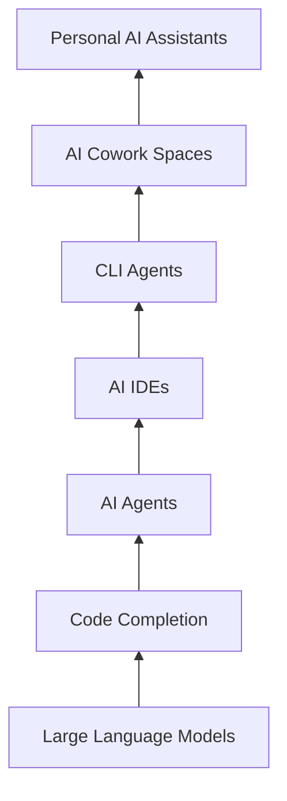

# Trending-in-Artificial-Intelligence

A living timeline of how **Artificial Intelligence for developers is evolving**, starting from the **latest paradigm shifts** and moving backward to foundational breakthroughs.

This repository tracks **what’s trending, why it matters, and where it’s happening** in the AI ecosystem.

> Keep the record of advancements in Dev AI TOOLS

### AI Evolution Timeline (Newest → Oldest)

#### 1. Personal AI Assistants (Newest)

AI systems that act as **persistent, personalized collaborators** — understanding user context, goals, and workflows over time.

**Notable projects**
- [**OpenClaw**](https://github.com/openclaw/openclaw) — Your own personal AI assistant. Any OS. Any Platform. The lobster way.
  - Source: [https://github.com/openclaw/openclaw](https://github.com/openclaw/openclaw)
  - Signal: Early but high attention

#### 2. AI Cowork Spaces
Shared environments where **multiple AI agents collaborate with humans** on complex tasks like software development, research, or operations.

**Why this trend matters**
- AI becomes a “team”, not a tool
- Mirrors real-world collaboration

**Notable projects**

- [**Claude Cowork**](https://www.anthropic.com/product/cowork) — Collaborative AI workspace for coding and reasoning
  - Source: Anthropic ecosystem
  - Signal: Strong interest among advanced developers

#### 3. CLI Agents
Terminal-first AI agents designed for **power users and developers**, integrating deeply with local tools and workflows.

**Why this trend matters**
- Fits existing developer habits
- High trust, low abstraction

**Notable projects**

- [**Claude Code**](https://www.anthropic.com/product/code) — Agentic coding directly in the terminal
  - Source: Anthropic
  - Signal: Rapid adoption among senior devs

- [**Gemini CLI**](https://ai.google.dev/gemini-api/docs/cli) — Command-line AI agent by Google
  - Source: Google
  - Signal: Growing ecosystem support

#### 4. AI IDEs
AI-native development environments where AI is a **first-class collaborator**, not a plugin.

**Why this trend matters**
- Full codebase understanding
- Shift from autocomplete → co-development

**Notable projects**

- [**Cursor**](https://cursor.sh) — AI-first code editor
  - Source: [https://cursor.sh](https://cursor.sh)
  - Signal: Strong indie & startup adoption

- [**Windsurf**](https://www.windsurf.dev/) — Agentic IDE with task-level reasoning
  - Source: Codeium
  - Signal: Competing with traditional IDEs

#### 5. AI Agents (LangChain / AutoGen Era)
Goal-driven, multi-step AI systems capable of planning, tool use, and execution.

**Why this trend matters**
- Enabled autonomous workflows
- Foundation for IDEs, CLIs, and coworkers

**Notable projects**

-  [**LangChain**](https://github.com/langchain-ai/langchain) — Framework for building LLM-powered agents
  - Source: [https://github.com/langchain-ai/langchain](https://github.com/langchain-ai/langchain)
  - Signal: De facto standard

- [**AutoGen**](https://github.com/microsoft/autogen) — Multi-agent orchestration framework
  - Source: [https://github.com/microsoft/autogen](https://github.com/microsoft/autogen)
  - Signal: Widely used in research

#### 6. Code Completion
The first successful developer-facing application of LLMs.

**Why this trend matters**
- Proved AI productivity gains
- Normalized AI in daily dev workflows

**Notable projects**

- [**GitHub Copilot**](https://github.com/features/copilot) — Inline AI code suggestions
  - Source: GitHub
  - Signal: Mass adoption

- [**Tabnine**](https://www.tabnine.com/) — Early AI coding assistant
  - Source: GitHub
  - Signal: Pioneered the category

#### 7. Large Language Models (Oldest / Foundation)
Foundation models that enabled everything else in this timeline.

**Why this trend matters**
- Core abstraction layer for modern AI
- Reasoning, coding, and language understanding

**Notable projects**

- [**GPT-4.x**](https://openai.com/index/gpt-4/) — General-purpose reasoning and coding model
  - Source: OpenAI
  - Signal: Industry benchmark

- [**Claude 3.x**](https://www.anthropic.com/product/claude-3) — Long-context, reasoning-first LLM
  - Source: Anthropic
  - Signal: Popular in dev tooling

#### Contributing
Contributions are welcome! Please see [CONTRIBUTING.md](CONTRIBUTING.md) for guidelines on how to suggest new trends or add projects to the timeline.

#### License
This repository is licensed under the [MIT License](LICENSE).
